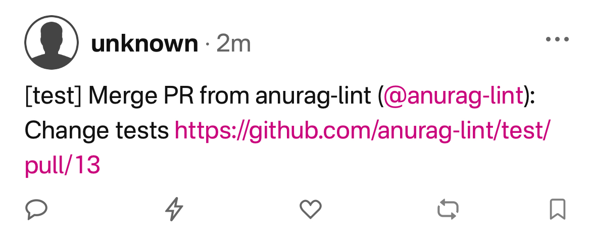

# Nostr Notifications
This action allows sending a note to Nostr when an event occurs in the repository where it is used. Currently, the implementation only covers sending notifications upon the merge of a PR, though event coverage will be expanded in the future.

The note will include the repository (in brackets), the user who created the pull request (mentioned with their Nostr public key if they have one configured in the "socials" section of their profile), the PR title, and a link to it.

```
[<repository>] Merge PR from <Github user> (@<nostr user>): <PR tittle> <PR Link>
```


## Events

Currently, this Action only processes and creates notes in Nostr when a PR is closed and merged. To achieve this, the workflow using it must be triggered with the following configuration:

```yaml
on:
  pull_request:
    types: [closed]
```

If other events are specified in the workflow configuration, the action execution will not result in an error. It will complete with a `success` status but will not send the note and will display the following messages in the execution log:

- Events other than `pull_request`
    ```yaml
    on:
        push:
    ```
    This will interrupt the execution of the action, displaying the following message in the log:

    ```
    Unknown event. Can only be run on a pull request merge.
    ```

- `pull_request` events with a `type` other than `closed`

    ```yaml
    on:
        pull_request:
            types: [opened]
    ```

    This will interrupt the execution of the action, displaying the following message in the log:

    ```
    Unknown event. Can only be run on a pull request merge.
    ```

- `pull_request` events with type set to `closed`, but the PR is not merged

    ```yaml
    on:
        pull_request:
            types: [clossed]
    ```
    and

    ```bash
    ${{ github.event.pull_request.merged }} != true
    ```

    This will interrupt the execution of the action, displaying the following message in the log:

    ```
    This PR was not merged.
    ```

## Inputs

The action has the following **required** input fields.

### `nostr_relays`

Specify the list of relays, separated by commas, to which the note will be sent. This can be defined directly in the YAML file:

```yaml
nostr_relays: 'wss://nos.lol,wss://relay.damus.io'
```

Or through an Action variables.

```yaml
nostr_relays: ${{ vars.NOSTR_RELAYS }}
```

If you want to keep the list of relays hidden, you can use an Action secrets:

```yaml
nostr_relays: ${{ secrets.NOSTR_RELAYS }}
```

The last two options are the recommended ones.

### `nostr_private_key`

Specify the private key in hexadecimal format that will sign the note (the Bech32 nsec format is not allowed). Since the action input will be displayed in the workflow execution log, it **must be specified as an Action secret**:

```yaml
nostr_private_key: ${{ secrets.NOSTR_PRIVATE_KEY }}
```

:warning: **The private key should never be specified in plain text in the workflow file or through an Action variable, as it will be visible to everyone.**

## Outputs

There are no output data.

## Runner

Currently, the action can only be executed on Linux or macOS runners. For example:

```yaml
runs-on: ubuntu-latest
```

o

```yaml
runs-on: macos-latest
```

## Example

Below is an example of a workflow using the action:

```yaml
name: Test nostr notifications

on:
  pull_request:
    types: [closed]
  
jobs:
  notification:
    runs-on: ubuntu-latest
    steps:
      - id: send_notification
        uses: anurag-lint/nostr-notifications@v1.0.0 
        with:
          nostr_relays: ${{ vars.NOSTR_RELAYS }}
          nostr_private_key: ${{ secrets.NOSTR_PRIVATE_KEY }}
```

If everything executes correctly, the workflow log will display something like the following:

```log
Note to send:
{
    "public_key": "00006d0980f4caf2e6ed4a525e415e1fa6bc081631055582b16c1770ab4be33b",
    "content": "[test] Merge PR from anurag-lint (nostr:npub1anuragxtjc9pvp6lcr2kf7a2kkx592mmmptwpvxww5uzj7dwnr0shm0q76): Update test https://github.com/anurag-lint/test/pull/12",
    "created_at": 1738659152,
    "kind": 1,
    "tags": [
        [
            "p",
            "ecf83ea0cb960a16075fc0d564fbaab58d42ab7bd856e0b0ce75382979ae98df"
        ]
    ],
    "signature": "ac8040cc38c072bdd9a7917bb3b3450a023551c93d95b047f5fa6123842e5fd059dc9769a7652f128138169704388e0817378547a57d9dd7668afa8aeb66cb1e",
    "id": "eea6a0dfc2cfb78a595dbd13a96b9ec325495014b8f21f239eebb9ea51dcf2a9"
}
Sending note to relay: wss://nos.lol
Sending note to relay: wss://relay.damus.io
Note successfully sent to ['wss://nos.lol', 'wss://relay.damus.io']
```

## Bugs and improvements

If you detect any errors or want to suggest an improvement, feel free to create an issue.

## Credit

I must mention @laanwj, whose code from their [ghi](https://github.com/laanwj/ghi) repository I partially used for the scripts.
